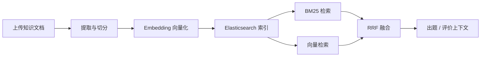
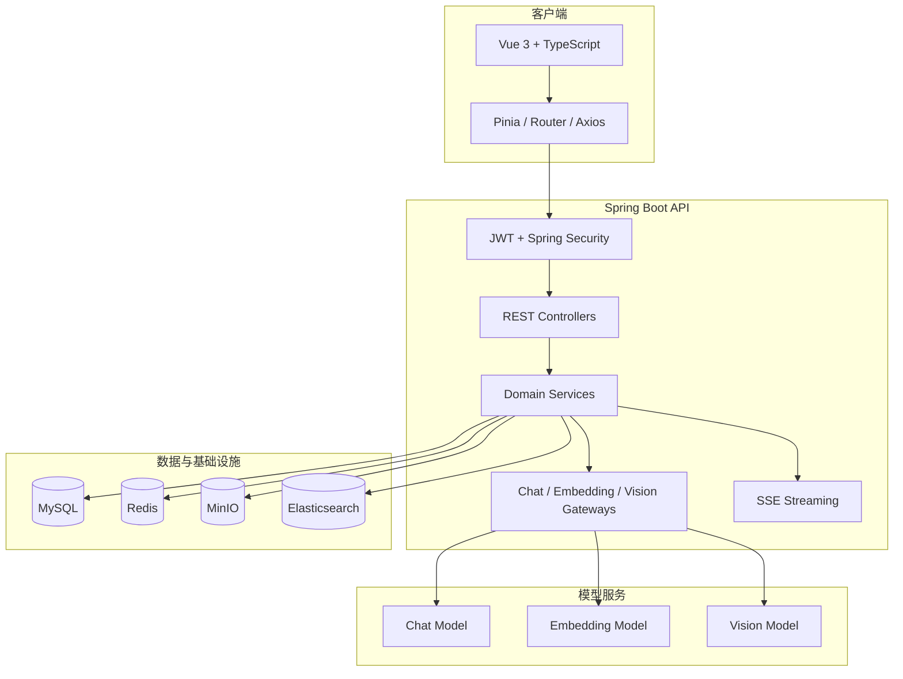

<div align="center">

# Career Orbit

## 简历驱动、RAG 增强、可私有化部署的 AI 模拟面试平台

Career Orbit 不只是一个把问题交给大模型的聊天页面。它从真实简历出发，把简历解析、能力诊断、岗位分析、知识检索、面试出题、动态追问、回答评价和成长报告连接成一条可追溯的完整求职训练链路。

[](https://github.com/jeremylin717/career-orbit/actions/workflows/ci.yml)


**真实数据 · 真实检索 · 真实模型调用 · 不伪造面试结果**

[快速开始](#快速开始) · [核心亮点](#核心亮点) · [系统架构](#系统架构) · [参与贡献](#参与贡献)

</div>

> 如果这个项目能帮助你学习 AI 工程、准备面试或搭建自己的求职产品，欢迎点一个 **Star**。你的反馈也会帮助 Career Orbit 继续完善。

## 目录

- [项目定位](#项目定位)
- [核心亮点](#核心亮点)
- [与普通 AI 面试 Demo 的区别](#与普通-ai-面试-demo-的区别)
- [完整业务流程](#完整业务流程)
- [功能详解](#功能详解)
- [系统架构](#系统架构)
- [技术栈](#技术栈)
- [项目结构](#项目结构)
- [快速开始](#快速开始)
- [模型与环境配置](#模型与环境配置)
- [测试与质量保障](#测试与质量保障)
- [适合谁使用](#适合谁使用)
- [路线图](#路线图)
- [参与贡献](#参与贡献)

## 项目定位

Career Orbit 面向希望进行高质量求职训练的开发者，也面向想学习完整 AI 应用工程的开发者。

它重点解决三个问题：

1. **面试内容不够个性化**：通用题库无法理解候选人的真实项目和技术经历。
2. **大模型回答缺少可信依据**：只依赖模型记忆容易产生泛化问题、重复问题和虚构评价。
3. **训练过程无法沉淀**：一次聊天结束后，问题、回答、追问关系、得分和改进方向很难持续跟踪。

因此，Career Orbit 以真实简历为起点，以知识库和岗位信息作为上下文，以可恢复的面试会话为核心，将每一次训练沉淀为可查询、可比较、可继续优化的数据。

## 核心亮点

### 1. 从真实简历出发，而不是从空白聊天框开始

用户上传 PDF、Word 或文本简历后，系统会：

- 将原始文件保存到 MinIO；
- 使用 Apache Tika 提取文本；
- 调用 Chat 模型生成结构化简历档案；
- 将原始内容、解析结果和版本信息保存到 MySQL；
- 基于真实经历生成诊断、优化建议和后续面试题。

系统保留简历版本链，优化不会直接覆盖原始版本，方便回看修改历史和比较不同版本。

### 2. Chat、Embedding、Vision 三类模型完全解耦

Career Orbit 没有把所有能力绑定在单一供应商上：

- **Chat 模型**：结构化简历、生成题目、评价回答、生成报告；
- **Embedding 模型**：知识文档向量化和语义检索；
- **Vision 模型**：识别图片形式的岗位描述；
- 三类网关可分别配置地址、API Key、模型和超时时间；
- 兼容 OpenAI 风格接口，便于接入不同模型服务。

例如，可以使用 DeepSeek 负责对话，通义千问负责向量和视觉能力，不需要修改业务代码。

### 3. BM25 + 向量召回 + RRF 的混合 RAG

知识库不是简单的全文搜索，也不是只做向量相似度：

1. 管理员上传真实知识文档；
2. 系统提取内容并切分为知识片段；
3. Embedding 网关生成向量；
4. Elasticsearch 同时执行 BM25 关键词检索与向量检索；
5. 使用 Reciprocal Rank Fusion（RRF）合并两路结果；
6. 将检索上下文交给题目生成和回答评价流程。

这种方式既能找准 Java、Redis、DDD 等明确技术词，也能覆盖表达不同但语义相近的内容。

### 4. 真正的动态追问，而不是固定题目轮播

系统会保存每一道主问题、用户回答、模型评分、追问内容和父子关系。模型根据当前回答质量判断是否需要追问，面试过程不再只是按数组顺序展示问题。

会话状态同时结合 Redis 与 MySQL：

- Redis 提供面试过程中的快速状态访问；
- MySQL 保存可恢复、可审计的长期记录；
- 页面刷新或短暂中断后，可以根据持久化数据继续流程；
- 最终报告能够还原完整问答链路，而不只保留一个总分。

### 5. SSE 实时输出，降低长模型请求的等待感

面试问题流通过 Server-Sent Events 转发模型输出。前端可以逐步接收内容，避免用户长时间面对没有反馈的页面，也为后续接入更完整的流式模型响应保留了扩展空间。

### 6. 明确拒绝“假成功”

项目默认不提供伪造的模型回答、虚构分数或预置报告：

- 模型未配置时返回明确的未配置错误；
- MySQL、Redis、Elasticsearch 或 MinIO 不可用时暴露真实依赖状态；
- 管理员可以查看模型配置状态与 AI 调用日志；
- 自动化测试使用独立测试配置，不污染真实业务数据。

这让 Career Orbit 更适合作为 AI 工程实践项目，而不是只能演示页面效果的静态原型。

### 7. 可以在本地或内网私有化部署

简历和面试回答都属于敏感数据。Career Orbit 将 MySQL、Redis、Elasticsearch、MinIO 和模型地址全部配置化，可以部署在个人电脑、实验室服务器或企业内网。只有所选择的模型调用需要离开本地环境。

### 8. 不只有用户端，也包含真实管理能力

管理员可以管理知识文档、提示词模板、用户、模型状态和调用日志。普通用户访问管理路由会进入真实的 403 页面，而不是仅仅隐藏菜单。

## 与普通 AI 面试 Demo 的区别

| 对比项 | 常见 AI 面试 Demo | Career Orbit |
| --- | --- | --- |
| 输入来源 | 手动输入几个关键词 | 真实简历、岗位信息、知识文档 |
| 文件处理 | 浏览器临时读取 | MinIO 原文件保存 + Tika 提取 + MySQL 持久化 |
| 检索方式 | 无检索或简单向量检索 | BM25 + 向量检索 + RRF 融合 |
| 模型接入 | 单模型、代码中写死 | Chat / Embedding / Vision 独立网关 |
| 面试流程 | 固定问题列表 | 根据回答质量动态追问 |
| 会话状态 | 仅保存在页面内存 | Redis 快速状态 + MySQL 长期记录 |
| 评价结果 | 返回一次性文本 | 问答链、得分、反馈和报告持久化 |
| 权限控制 | 无或前端判断 | Spring Security、JWT、服务端角色校验 |
| 异常处理 | 使用 Mock 数据兜底 | 真实报错，不伪造成功 |
| 部署方式 | 在线 Demo | 支持本地和内网私有部署 |
| 工程质量 | 只保证能启动 | 后端测试、前端测试、CI、依赖审计 |

## 完整业务流程

```mermaid
flowchart LR
    A[注册 / 登录] --> B[上传真实简历]
    B --> C[MinIO 保存原文件]
    C --> D[Tika 提取文本]
    D --> E[模型结构化与诊断]
    E --> F[保存简历版本]
    F --> G[输入岗位信息]
    G --> H[RAG 混合检索]
    H --> I[生成个性化题目]
    I --> J[开始模拟面试]
    J --> K[回答评价与动态追问]
    K --> L[保存问答链]
    L --> M[生成成长报告]
```



管理员知识库流程：



## 功能详解

### 用户与安全

- 邮箱注册、登录和当前用户查询；
- BCrypt 密码哈希；
- JWT 无状态身份认证；
- 普通用户与管理员角色隔离；
- 后端统一异常响应；
- 管理接口只返回脱敏后的模型配置信息。

### 简历中心

- 支持 PDF、DOC、DOCX 和文本文件；
- 原始文件存储与授权下载；
- 文件内容提取和类型校验；
- 模型结构化解析；
- AI 简历诊断；
- 优化版本保存和版本链追踪；
- 防止越权访问其他用户简历。

### 知识库与 RAG

- 管理员上传知识文档；
- 文档切片和元数据保存；
- 独立 Embedding 模型调用；
- Elasticsearch BM25 检索；
- Elasticsearch 向量检索；
- RRF 排名融合；
- 检索失败时返回清晰诊断信息。

### 题目生成

- 选择真实简历版本；
- 输入岗位名称和岗位描述；
- 图片岗位描述可通过 Vision 模型识别；
- 配置技术方向、难度和题目数量；
- 结合简历和知识库上下文生成题目；
- 题目去重并保存为可复用题集。

### 模拟面试

- 从已生成题集创建面试场次；
- Redis 保存进行中的面试状态；
- SSE 推送问题内容；
- 保存用户原始回答；
- 模型对回答进行评分和反馈；
- 根据回答结果生成追问；
- 主问题与追问通过父子关系保存；
- 防止重复提交和重复生成报告。

### 报告与记录

- 聚合整场面试问答；
- 保存模型生成的总结报告；
- 查看历史面试场次；
- 展示每题回答、评分和反馈；
- 为后续趋势分析和训练计划提供数据基础。

### 管理后台

- 用户与角色信息查看；
- 知识文档管理；
- 提示词模板管理；
- Chat、Embedding、Vision 模型配置状态；
- AI 调用日志、耗时和错误信息查看；
- 普通用户服务端拒绝访问。

## 系统架构



## 技术栈

| 层级 | 技术 |
| --- | --- |
| Web | Vue 3、TypeScript、Vite、Pinia、Vue Router、Axios、Element Plus |
| API | Java 17、Spring Boot 3.5、Spring MVC、Spring Security、Bean Validation |
| 数据访问 | MyBatis-Plus、MySQL、H2 测试数据库 |
| AI | OpenAI 兼容 Chat / Embedding / Vision 网关、RAG、RRF |
| 文件处理 | MinIO、Apache Tika |
| 搜索与状态 | Elasticsearch、Redis |
| 接口与运维 | SSE、Springdoc OpenAPI、Actuator |
| 工程保障 | Maven Wrapper、Vitest、GitHub Actions、Dependabot、Docker Compose |

## 项目结构

```text
career-orbit/
├─ backend/
│  ├─ .mvn/                   Maven Wrapper 配置
│  ├─ db/                     历史升级脚本
│  └─ src/
│     ├─ main/java/
│     │  └─ com/careerorbit/
│     │     ├─ ai/            三类模型网关与提示词
│     │     ├─ config/        安全、OpenAPI、启动配置
│     │     ├─ controller/    REST 与 SSE 接口
│     │     ├─ entity/        MySQL 实体
│     │     ├─ mapper/        MyBatis-Plus Mapper
│     │     ├─ security/      JWT 认证链路
│     │     ├─ service/       简历、RAG、出题、面试服务
│     │     └─ storage/       MinIO 对象存储
│     └─ test/                单元测试与集成测试
├─ frontend/
│  └─ src/
│     ├─ api/                 API 类型与请求封装
│     ├─ stores/              Pinia 状态管理
│     ├─ views/               业务页面
│     └─ styles/              全局视觉样式
├─ scripts/                   Windows 启停与基础设施脚本
├─ samples/                   面试题库与评分标准示例
├─ docs/                      架构、实现与启动文档
├─ .github/                   CI、Dependabot、Issue/PR 模板
├─ docker-compose.yml
└─ .env.example
```

## 快速开始

### 环境要求

- Java 17 或更高版本；
- Node.js 20 或更高版本；
- Docker Desktop，或自行安装 MySQL 8、Redis、Elasticsearch 8 和 MinIO；
- 至少一套兼容 OpenAI 请求风格的 Chat 模型服务；
- 若使用知识库检索，还需要 Embedding 模型服务。

### 1. 克隆项目

```bash
git clone https://github.com/jeremylin717/career-orbit.git
cd career-orbit
```

### 2. 创建本地配置

Linux / macOS：

```bash
cp .env.example .env
```

Windows PowerShell：

```powershell
Copy-Item .env.example .env
```

请至少修改 `.env` 中的 JWT、管理员、数据库和 MinIO 凭据。`.env` 已加入 `.gitignore`，不要把真实密钥提交到仓库。

### 3. 启动基础设施

```bash
docker compose up -d
```

该命令会启动：

| 服务 | 默认地址 | 用途 |
| --- | --- | --- |
| MySQL | `localhost:3306` | 用户、简历、题集、面试和报告 |
| Redis | `localhost:6379` | 进行中的面试状态 |
| Elasticsearch | `localhost:9200` | BM25 与向量检索 |
| MinIO | `localhost:9000` | 简历和知识文档原文件 |
| MinIO Console | `localhost:9001` | 对象存储管理界面 |

### 4. 启动后端

Linux / macOS：

```bash
cd backend
./mvnw spring-boot:run -Dspring-boot.run.profiles=dev
```

Windows：

```powershell
cd backend
.\mvnw.cmd spring-boot:run "-Dspring-boot.run.profiles=dev"
```

后端地址：

- API：`http://localhost:8080`
- Swagger：`http://localhost:8080/swagger-ui.html`
- Health：`http://localhost:8080/actuator/health`

### 5. 启动前端

```bash
cd frontend
npm ci
npm run dev
```

访问 `http://localhost:5173`。

### Windows 一键启动

如果本地依赖已经准备好，也可以直接双击 `一键启动.bat`，或执行：

```powershell
powershell -ExecutionPolicy Bypass -File .\scripts\start-all.ps1
```

启动日志会写入 `.run/`。双击 `停止全部.bat` 可以关闭项目进程。

## 模型与环境配置

### 对话模型示例

```dotenv
CHAT_BASE_URL=https://api.deepseek.com
CHAT_API_KEY=your-chat-key
CHAT_MODEL=deepseek-chat
CHAT_CONFIGURED=true
```

### Embedding 模型示例

```dotenv
EMBEDDING_BASE_URL=https://dashscope.aliyuncs.com/compatible-mode
EMBEDDING_API_KEY=your-embedding-key
EMBEDDING_MODEL=text-embedding-v3
EMBEDDING_CONFIGURED=true
```

### Vision 模型示例

```dotenv
VISION_BASE_URL=https://dashscope.aliyuncs.com/compatible-mode
VISION_API_KEY=your-vision-key
VISION_MODEL=qwen-vl-max
VISION_CONFIGURED=true
```

Vision 未单独填写 Key 时，可以按 `.env.example` 的说明复用 Embedding 配置。

### 主要环境变量

| 变量 | 说明 |
| --- | --- |
| `JWT_SECRET` | JWT 签名密钥，至少使用 32 位随机字符 |
| `ADMIN_EMAIL` / `ADMIN_PASSWORD` | 首次启动创建的管理员账号 |
| `DB_URL` / `DB_USER` / `DB_PASSWORD` | MySQL 连接配置 |
| `REDIS_HOST` / `REDIS_PORT` | Redis 连接配置 |
| `MINIO_ENDPOINT` | MinIO API 地址 |
| `MINIO_ACCESS_KEY` / `MINIO_SECRET_KEY` | MinIO 凭据 |
| `ELASTICSEARCH_URL` | Elasticsearch 地址 |
| `CHAT_*` | Chat 模型配置 |
| `EMBEDDING_*` | Embedding 模型配置 |
| `VISION_*` | Vision 模型配置 |

完整变量见 [.env.example](.env.example)。

## 测试与质量保障

后端测试：

```bash
cd backend
./mvnw test
```

前端测试与生产构建：

```bash
cd frontend
npm ci
npm test
npm run build
npm audit
```

当前仓库包含：

- Chat Gateway 测试；
- 注册、登录和密码校验测试；
- 简历所有权与越权访问测试；
- RAG 检索逻辑测试；
- 题目生成与去重测试；
- 动态追问与报告幂等性测试；
- Spring Boot 集成配置测试；
- 前端 API 和管理员路由守卫测试；
- GitHub Actions 后端、前端双任务 CI；
- Dependabot Maven 与 npm 月度依赖更新。

## 适合谁使用

### 求职者

希望围绕自己的真实简历和目标岗位进行针对性练习，并保留长期训练记录。

### Java / 全栈开发者

希望学习 Spring Boot、Vue 3、JWT、MyBatis-Plus、Redis、Elasticsearch、MinIO 和 SSE 如何组合为完整产品。

### AI 应用开发者

希望参考多模型网关、RAG 混合检索、结构化输出、动态追问和 AI 调用日志的工程实现。

### 教学与实验项目

可作为课程设计、毕业设计、AI 工程实验或企业内部面试训练平台的基础版本继续扩展。

## 已知边界

- 模型输出仍可能存在不准确内容，评分只能作为训练参考；
- 完整 AI 流程依赖用户自行配置真实模型服务；
- 管理后台提示词模板目前已提供维护能力，接入实际运行时调用仍在路线图中；
- 数据库初始化目前使用 `schema.sql` 与兼容升级逻辑，后续计划迁移到 Flyway；
- 项目当前更适合作为个人训练、教学和工程参考，生产部署前还需要按实际规模完成安全加固与容量评估。

## 路线图

- [ ] 将数据库提示词模板接入真实模型调用，并支持版本与回滚；
- [ ] 使用 Flyway 管理数据库版本；
- [ ] 增加完整浏览器端 E2E 测试；
- [ ] 增加模型调用重试、限流和成本统计；
- [ ] 优化前端公共依赖分包和首屏体积；
- [ ] 增加更多模型供应商配置示例；
- [ ] 增加面试能力趋势和训练计划；
- [ ] 提供 Linux 部署脚本与生产环境 Compose 示例。

## 安全说明

- 不要提交 `.env`、API Key、访问令牌或生产数据库凭据；
- 不要将真实简历、面试回答或用户数据提交到 Issue；
- 生产环境请替换 Docker Compose 中的开发凭据；
- 建议仅在可信网络开放 MySQL、Redis、Elasticsearch 和 MinIO；
- 发现安全问题时请阅读 [SECURITY.md](SECURITY.md)，不要创建公开漏洞 Issue。

## 参与贡献

欢迎以下形式的贡献：

- 修复 Bug 或补充测试；
- 改进模型提示词和结构化输出稳定性；
- 增加新的模型供应商适配；
- 优化 RAG 召回与排序效果；
- 改进前端体验、无障碍能力和移动端适配；
- 完善文档、部署示例和国际化支持。

提交 Pull Request 前，请阅读：

- [CONTRIBUTING.md](CONTRIBUTING.md)
- [CODE_OF_CONDUCT.md](CODE_OF_CONDUCT.md)
- [SECURITY.md](SECURITY.md)

## 许可证

Career Orbit 使用 [MIT License](LICENSE) 开源。你可以自由使用、学习、修改和分发，但请保留原许可证声明。

---

<div align="center">

**如果你认同“AI 面试不应该只是一段聊天”，欢迎 Star、Fork 或提交建议。**

</div>
