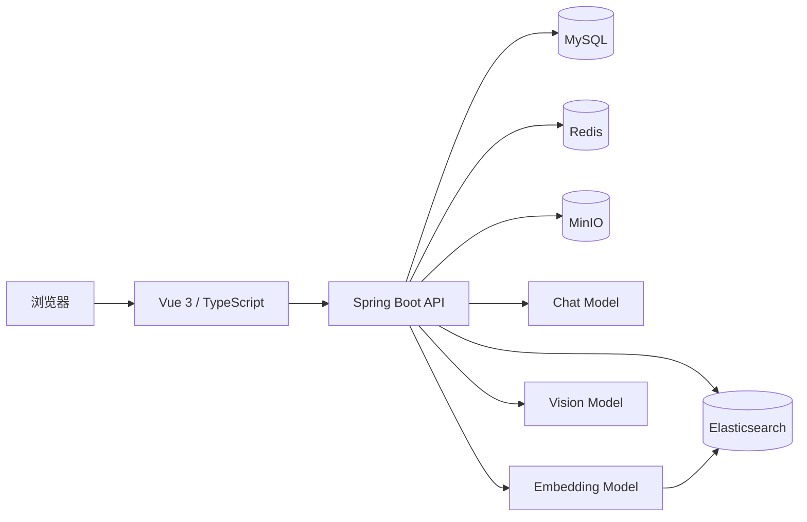

<div align="center">

# Career Orbit

### 可私有化部署的简历驱动 AI 模拟面试平台

从真实简历出发，通过 RAG 知识检索、动态追问和模型评价，完成简历诊断、题目生成、模拟面试与成长报告闭环。


</div>

## 为什么做 Career Orbit

许多 AI 面试项目只展示一段聊天对话。Career Orbit 更关注可验证的完整业务链路：真实文件持久化、真实模型调用、可恢复的面试状态、知识库检索和可追溯的问答报告。依赖或模型未配置时，系统会明确返回错误，不用假数据伪造成功。

## 核心能力

- **简历工作流**：PDF、Word、文本上传至 MinIO，经 Apache Tika 提取并由模型结构化。
- **AI 简历诊断**：保留简历版本链，支持诊断、优化建议和历史追溯。
- **岗位驱动出题**：结合简历、岗位信息、难度与知识库生成针对性题目。
- **RAG 混合检索**：Elasticsearch BM25 与向量召回通过 RRF 合并。
- **动态模拟面试**：Redis 与 MySQL 保存会话状态，根据回答质量决定是否追问。
- **实时交互**：通过 SSE 转发模型输出，改善长请求交互体验。
- **成长报告**：保存问答父子关系、评分、反馈和最终面试报告。
- **管理能力**：知识库、提示词、模型状态、用户和 AI 调用日志管理。
- **多模型网关**：Chat、Embedding、Vision 独立配置，兼容 OpenAI 风格接口。

## 系统架构



## 技术栈

| 层级 | 技术 |
| --- | --- |
| Web | Vue 3、TypeScript、Vite、Pinia、Vue Router、Element Plus |
| API | Java 17、Spring Boot 3、Spring Security、MyBatis-Plus、SSE |
| AI | OpenAI 兼容 Chat / Embedding / Vision 网关、RAG、RRF |
| 数据 | MySQL、Redis、Elasticsearch、MinIO |
| 工程 | Maven Wrapper、Vitest、GitHub Actions、Docker Compose |

## 快速开始

### 环境要求

- Java 17+
- Node.js 20+
- Docker Desktop，或自行安装 MySQL 8、Redis、Elasticsearch 8 与 MinIO

### 1. 配置环境变量

```bash
cp .env.example .env
```

Windows PowerShell：

```powershell
Copy-Item .env.example .env
```

至少修改 `.env` 中的 `JWT_SECRET`、`ADMIN_PASSWORD`、数据库和 MinIO 凭据。需要使用模型功能时，再填写对应 API Key：

```dotenv
CHAT_BASE_URL=https://api.deepseek.com
CHAT_API_KEY=your-chat-key
CHAT_MODEL=deepseek-chat
CHAT_CONFIGURED=true

EMBEDDING_BASE_URL=https://dashscope.aliyuncs.com/compatible-mode
EMBEDDING_API_KEY=your-embedding-key
EMBEDDING_MODEL=text-embedding-v3
EMBEDDING_CONFIGURED=true
```

### 2. 启动基础设施

```bash
docker compose up -d
```

### 3. 启动后端

```bash
cd backend
./mvnw spring-boot:run -Dspring-boot.run.profiles=dev
```

Windows 可使用 `mvnw.cmd`。API 默认运行在 `http://localhost:8080`，Swagger 位于 `http://localhost:8080/swagger-ui.html`。

### 4. 启动前端

```bash
cd frontend
npm ci
npm run dev
```

访问 `http://localhost:5173`。

### Windows 一键启动

准备好 `.env` 后，可双击 `一键启动.bat`，或者执行：

```powershell
powershell -ExecutionPolicy Bypass -File .\scripts\start-all.ps1
```

运行日志位于 `.run/`；双击 `停止全部.bat` 可关闭项目进程。

## 项目结构

```text
career-orbit/
├─ backend/          Spring Boot API、领域服务与测试
├─ frontend/         Vue 3 Web 应用
├─ scripts/          Windows 启停和本地基础设施脚本
├─ samples/          示例题库与评分标准
├─ docs/             架构、实现报告和启动文档
├─ docker-compose.yml
└─ .env.example
```

## 测试

```bash
cd backend
./mvnw test
```

```bash
cd frontend
npm ci
npm test
npm run build
```

## 当前路线图

- [ ] 将管理后台维护的提示词模板接入实际模型调用
- [ ] 使用 Flyway 管理数据库版本
- [ ] 增加完整浏览器端 E2E 测试
- [ ] 优化前端公共依赖分包与加载体积
- [ ] 增加更多模型供应商配置示例

## 安全说明

不要提交 `.env`、API Key、真实简历或用户数据。发现安全问题时，请阅读 [SECURITY.md](SECURITY.md)，不要直接创建公开漏洞 Issue。

## 参与贡献

欢迎提交 Issue 和 Pull Request。开始前请阅读 [CONTRIBUTING.md](CONTRIBUTING.md) 与 [CODE_OF_CONDUCT.md](CODE_OF_CONDUCT.md)。

## 许可证

本项目基于 [MIT License](LICENSE) 开源。

